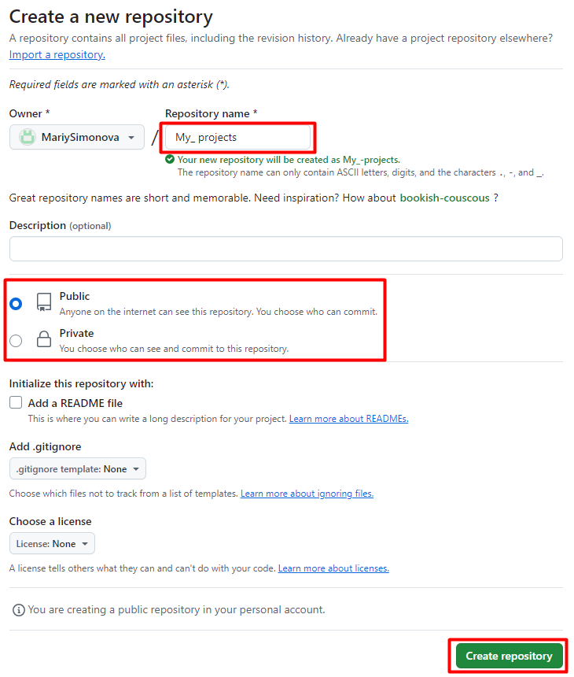

1. В вашем репозитории перейдите на вкладку «Repositories» и выберите «New».

*Вкладка «Repositories» и кнопка «New»*

2. Назовите свой репозиторий.
3. Выберите каким он будет обще доступны **«Public»** или частным **«Private»**.
4. Нажмите кнопку **«Create repository»**.

*Создание нового репозитория*

Ваш репозиторий создан!